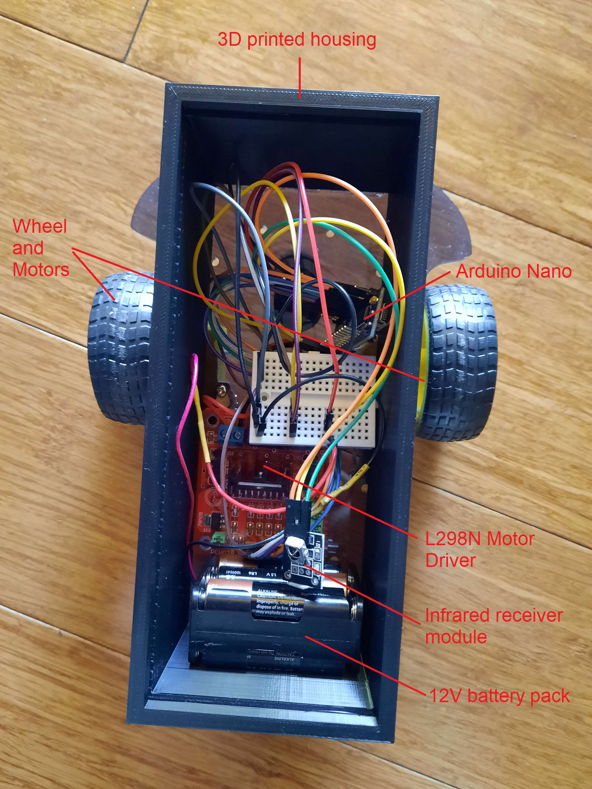

# Remote Controlled Car
A small car that can be remotely controlled via an infrared remote, built with Arduino.

# Project Screenshots

# Reflection
This was a 1 month personal project I took up to strengthen my C++, Electrical, hardware and CAD drawing knowledge. I set out to build a system that would be able to receive and use data sent wirelessly without needing to write an API. 

A challenge I faced during this project was building the circuitry for the car. With multiple electronics and a very limited space, making the circuitry as compact as possible became very difficult.

This project was coded in Arduino, which is a C++ based program and the Frame and lid for the housing was drawn on Solidworks
